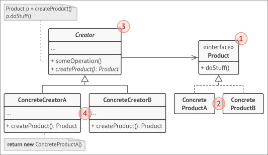

#### 简单工厂模式

简单工厂模式并不属于设计模式的一种，反而更像是一种编程习惯。

简单工厂模式包含如下角色

- 抽象产品：定义了产品的规范，描述了产品的主要特征和性能
- 具体产品：实现或继承了抽象产品的子类
- 具体工厂：提供了创建产品的方法，调用中通过调用该方法来获取产品

```kt
abstract class Car(){
    abstract fun build()
}

class ChangCheng(): Car(){
    override fun build() {
        println("build changcheng")
    }
}

class ChangAn(): Car(){
    override fun build() {
        println("build changan")
    }
}

class CarFactory{
    fun create(type: String): Car{
        return when(type){
            "changcheng" -> ChangCheng()
            else -> ChangAn()
        }
    }
}
```

#### 优缺点

- 优点：把对象的创建和使用封开，更加容易拓展。
- 缺点新增产品时需要修改工厂类，违背了开闭原则。

### 工厂模式

如果在需要创建对象的时候直接新建一个对象，就会对该对象耦合严重，如果我们需要更换对象时，就需要对所有新建对象的地方都修改一边，这就违背了开闭原则。因此会使用工厂模式来创建对象，我们可以直接在工厂中创建对象，因此更换对象也可以直接在工厂中进行，这样就达到了与对象解耦的目的，因此，工厂模式最大的优点就是与对象解耦。

**工厂方法模式**完美的解决了上述缺点，遵循开闭原则



工厂方法模式包含如下角色：

- 抽象工厂：提供创建产品的接口，
- 具体工厂：主要是实现抽象工厂中的抽象方法，完成具体产品的创建
- 抽象产品：定义了产品的规范，描述了产品的主要特征和性能
- 具体产品：实现或继承了抽象产品的子类

```kt
abstract class Car(){
    abstract fun build()
}

interface CarFactory {
    fun createCar(): Car
}

class ChangChengFactory : CarFactory {
    override fun createCar(): Car {
        return ChangCheng()
    }
}

class ChangAnFactory : CarFactory {
    override fun createCar(): Car {
        return ChangAn()
    }
}

class Store(val factory: CarFactory) {
    fun create(): Car {
        return factory.createCar()
    }
}

fun main() {
    // 长安工厂生产汽车
    val store = Store(ChangAnFactory())
    store.create().build()

    // 长城工厂生产汽车
    val store1 = Store(ChangChengFactory())
    store1.create().build()
}
```

#### 优缺点

- 优点：完美的遵循了开闭原则。
- 缺点：新增一个产品需要增加几个类，增加了代码的复杂性。

### 抽象工厂模式

主要功能：提供统一的接口创建一系列相关的产品

提供创建一系列相关或相互依赖对象的接口。

- 提供创建一系列相关或相互依赖对象的接口，而不指定它们具体的类
- 将一组对象实现细节与它们的一般使用分离出来。


```kt
abstract class SuvCar(){
    abstract fun build()
}

interface CarFactory1 {
    fun createCar(): Car
    fun createSuvCar():SuvCar
}

class SmartFactory : CarFactory1 {
    override fun createCar(): Car {
        return ChangCheng()
    }

    override fun createSuvCar(): SuvCar {
        return SuvCar1()
    }
}

class Store1(val factory: CarFactory1) {
}

fun main() {
    val store = Store1(SmartFactory())
    store.factory.createCar().build()
    store.factory.createSuvCar().build()
}
```

#### 适用场景：
- 游戏服装套装，通常一整套一起换。
- 操作系统的组件模块，同一组模块需要对应相同的系统
  
#### 优点
- 规范创建相同系列产品的方式
- 只需要暴露创建接口，可以隐藏实现细节
- 容易改变产品系列
  
#### 缺点
- 扩展产品库需要额外工作：出了产品代码外，还需要改动Factory

### 总结
工厂方法对比简单工厂，增加了一层工厂抽象，实现专门的工厂生产专门的汽车；抽象工厂相比工厂方法，一个工厂可以生产不同类型的产品。简单工厂模式和工厂方法模式都是创建一类产品的模式，而抽象工厂模式是创建多个产品的模式，但是模式和工厂方法模式相同，只不过抽象工厂需要去写多个产品方法。

参考：

- [设计模式-创建型-抽象工厂(改进)](https://www.jianshu.com/p/3eb9014e1d53)

- [给人看的Kotlin设计模式——工厂方法 - 简书](https://www.jianshu.com/p/dd37feed0fe4)

- [给人看的Kotlin设计模式——抽象工厂 - 简书](https://www.jianshu.com/p/956d9d6d05fe)
