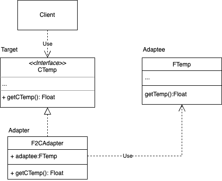

### 概念

Adapter（Wrapper） Pattern，连接两个不兼容的接口，让接口不兼容的对象能够相互合作。

#### 适配器中的角色

- 请求者Client：调用者
- 目标Target：定义了Client要使用的功能
- 转化对象Adaptee： 需要适配转化的对象
- 适配器Adapter：实现转化功能的对象 

#### 两种实现方式

- 类适配器模式，用继承


- 对象适配器模式，用组合



### 代码实现

```kt
interface CTemp {
    fun getCTemp(): Float
}

open class FTemp(
    val temp: Float
)

// 使用继承的方式
class F2CAdapter1(temp: Float) : FTemp(temp), CTemp {
    override fun getCTemp(): Float {
        return (temp - 32) * 5 / 9
    }
}

class F2CAdapter2(val fTemp: FTemp) : CTemp {
    override fun getCTemp(): Float {
        return (fTemp.temp - 32) * 5 / 9
    }

}

fun main() {
    val f = FTemp(100f)
    val adapter1 = F2CAdapter1(f.temp)

    println("类继承 f: ${f.temp},c:${adapter1.getCTemp()}")

    val adapter2 = F2CAdapter2(f)
    println("对象 f: ${f.temp},c:${adapter2.getCTemp()}")

}
```

### 优缺点

优点：
- 把转化代码从业务逻辑中分离出来
- 在不修改现有代码的情况下实现转化
- 让代码更加模块化而且可以复用

缺点：
- 代码复杂度会变高
- 重复代码
- 很难Debug

### 应用场景

- 基本应用：支持多接口，重用现有代码
- 连接遗留代码和新系统
- 连接第三方库
- 单元测试：模拟真正对象的行为

### 总结

安卓中recyclerview使用的适配器是对象适配器，RecyclerView.Adapter提供了抽象和泛型支持。安卓中上下文wrapper则使用了适配器模式，顶层是ContextWapper继承了Context、包装了ContextImpl，四大组建则继承ContextWapper实现各自的扩展。


参考：

- [【设计模式】适配器模式 - Nemo& - 博客园](https://www.cnblogs.com/blknemo/p/13257966.html)
- [适配器模式（Adapter模式）详解](https://www.jianshu.com/p/c87265610d2a)
