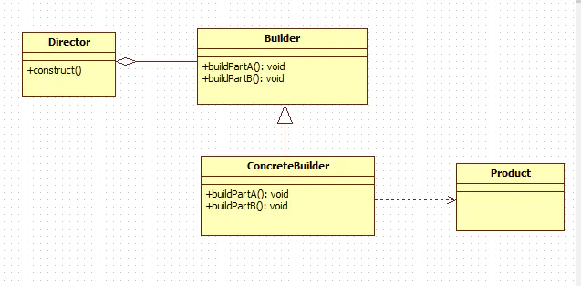

### 介绍

#### 主要作用

逐步构造复杂对象，该对象的属性更多的扩展属性，如Glide的使用。

#### 组成



- Builder：提供逐步创建产品的步骤

- Director：创建可复用的特定产品（规定Builder规定一系列的步骤创建产品，非必须）

- Product：具体的产品类（可能包含了相同的父类或接口）

### kt中实现

Kt中可以简化该模式的使用，下面介绍常见写法

#### 1. 使用具名可选参数

```kt
class Computer(
    val mainboard: String, // 主板
    val cpu: String, // 处理器
    val ram: String, // 内存
    val battery: String, // 电源
    val gpu: String? = null, // 显卡
    val hardDisk: String? = null, // 硬盘
    val networkInterface: String? = null, // 网线接口
    val cdDriver: String? = null, // 光驱
    val os: String? = null, // 系统
    val chassis: String? = null, // 机箱
    val mouse: String? = null, // 鼠标
    val keyboard: String? = null, // 键盘
    val monitor: String? = null // 显示器
)

fun main() {
    // 具名参数
    val computer = Computer(
        "超微X8QB6-F", "Intel Xeon E7-8870", "海盗船(CORSAIR) 复仇者LPX DDR4 2133 64GB 7000", "西门子豪华供电柜",
        gpu = "Leadtek/丽台Quadro Plex 7000",
        os = "Windows 11",
        mouse = "RAPOO雷柏 3710 2.4G激光无线鼠标",
        keyboard = "Optimus Maximus 多功能 概念式键盘",
        monitor = "Sharp/夏普 LB-1085 108英寸 FULL HD专业液晶显示器"
    )
}
```

具名函数的优点：

- 代码简洁优雅，无论是 Product 的类结构，或者是创建一个 Product 实例
- 创建 Product 实例时，显式指定参数名即可，无须按顺序传入
- 所有参数均使用 val 声明，相比 Builder 中使用 var 更加安全

#### 2. 使用apply，also作用域函数

```kt
class Car {
    var color: String = ""
    var doors: Int = 0
    var wheel: String = ""
    override fun toString(): String {
        return "Car(color='$color', doors=$doors, wheel='$wheel')"
    }
}

fun main() {
    val car = Car().apply {
        color = "Red"
        doors = 4
        wheel = "Good"
    }
    println(car)
}
```

#### 3. 标准写法

我们这里使用带接收器的Lambda表达式。

```kt
class Car1(
    val model: String? = null,
    val year: Int = 0
) {
    private constructor(builder: Builder) : this(
        builder.model,
        builder.year
    )

    class Builder {
        var model: String? = null
        var year: Int = -1

        fun build() = Car1(this)
    }

    companion object {
        /**
         * 带接收者的函数类型,这意味着我们需要向函数传递一个Builder类型的实例
         */
        inline fun build(block: Builder.() -> Unit) = Builder().apply(block).build()
    }

    override fun toString(): String {
        return "Car1(model=$model, year=$year)"
    }
}

fun main() {
    val car2 = Car1.build {
        model = "名字"
        year = 2017
    }
    println(car2)
}
```

#### 4. 结合lambda DSL优雅写法弹框示例

```kt
import androidx.annotation.StringRes

class Dialog1 {
    var title: String = ""
    var content: String = ""

    // 内敛函数结合lambda
    inline fun show(func: Dialog1.() -> Unit) {
        this.func()
        this.show()
    }

    fun show() {
        println("title:$title,content:$content")
    }
}

class Dialog2 {
    var title: String = ""
    var content: String = ""

    fun title(@StringRes res: Int? = null, text: CharSequence? = null): Dialog2 {
        text?.let {
            title = it.toString()
        }
        return this
    }

    fun content(@StringRes res: Int? = null, text: CharSequence? = null): Dialog2 {
        text?.let {
            content = it.toString()
        }
        return this
    }

    inline fun show(func: Dialog2.() -> Unit) {
        this.func()
        this.show()
    }

    fun show() {
        println("title:$title,content:$content")
    }
}

class Dialog private constructor(
    val title: String,
    val text: String?,
    val onAccept: (() -> Unit)?
) {
    class Builder(val title: String) {
        var text: String? = null
        var onAccept: (() -> Unit)? = null
        fun setText(text: String?): Builder {
            this.text = text
            return this
        }

        fun setOnAccept(onAccept: (() -> Unit)?): Builder {
            this.onAccept = onAccept
            return this
        }

        fun build() = Dialog(title, text, onAccept)
    }
}

fun main() {
    Dialog1().show {
        title = "标题"
        content = "内容"
    }

    Dialog2().show {
        title(text = "标题")
        content(text = "内容")
    }

    val dialog1 = Dialog.Builder("Some title")
        .setText("Great dialog")
        .setOnAccept { println("I was clicked") }
        .build()
    val dialog2 = Dialog.Builder("Another dialog")
        .setText("I have no buttons")
        .build()
    val dialog3 = Dialog.Builder("Dialog with just a title").build()
}
```

### 总结

**应用场景**

盖房子，定制汽车

**优点**

- 分步创建更加灵活
- 可以复用相同的制作代码
- 严格遵循单一职责原则

**缺点**
代码整体复杂度增加

生成器模式就是为了构建复杂对象，创建对象的方式是多步骤的。关于建造模式的变种写法参考（[Java 大白话讲解设计模式之 -- 建造者（Builder）模式 - 简书](https://www.jianshu.com/p/afe090b2e19c)）

#### 参考：

> [Kotlin 自带的Builder建造者模式](https://blog.csdn.net/EthanCo/article/details/102587193)
> 
> [Kotlin设计模式-Builder模式 - 简书](https://www.jianshu.com/p/75a3f2361e2a)
> 
> [秒懂设计模式之建造者模式（Builder pattern）](https://zhuanlan.zhihu.com/p/58093669)
> 
> [给人看的Kotlin设计模式——构造者模式](https://www.jianshu.com/p/f183ce902434)
> 
> [Kotlin - 改良构建者模式 - 掘金](https://juejin.cn/post/7071959631022538782)
> 
> [你会用Kotlin实现构建者模式吗？](https://zhuanlan.zhihu.com/p/267145868)
> 
> [Kotlin - 改良构建者模式 - 掘金](https://juejin.cn/post/7071959631022538782)
