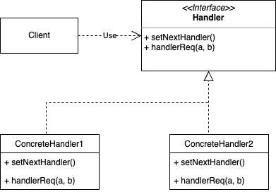

### 概念

允许多个对象按顺序处理请求或任务。

#### 角色介绍

- Handler: 处理器接口,提供设置后继者（可选）
- ConcreteHandler：具体处理器，处理请求

#### UML



### 代码实现


比如ATM机吐钱就可以使用责任链实现。

```kt
class PartialFunction<in P1, out R>(
    private val definetAt: (P1) -> Boolean,
    private val f: (P1) -> R
) : (P1) -> R {
    override fun invoke(p1: P1): R {
        if (definetAt(p1)) {
            return f(p1)
        } else {
            throw IllegalAccessException()
        }
    }

    fun isDefinedAt(p1: P1) = definetAt(p1)
}

/**
 * orElse 方法种可以传入另一个 PartialFunction 类对象 that，它也就是责任链模式中的后继者
 * infix 关键字让 orElse 成为一个中缀函数，从而让责任链调用的语法变得更加直观
 */
infix fun <P1, R> PartialFunction<P1, R>.orElse(that: PartialFunction<P1, R>): PartialFunction<P1, R> {
    return PartialFunction({
        this.isDefinedAt(it) || that.isDefinedAt(it)
    }) {
        when {
            this.isDefinedAt(it) -> this(it)
            else -> that(it)
        }
    }
}
```

什么是偏函数？

在Scala中偏函数使用PartialFuncation构建只处理输入参数的部分分支的函数，也就是带判断条件的函数。在python中作用就是把一个函数的某些参数给固定住（也就是设置成默认值），返回一个新的函数。这样调用的时候就会比较简单。

```kt
data class Current(var cash: Int, val message: MutableList<String>)

val RMB_5 = run {
    val definetAt: (Current) -> Boolean = { it.cash >= 5 }
    val handler: (Current) -> Unit = {
        println("处理5元")
        val num = it.cash / 5
        it.cash = it.cash % 5
        it.message.add("5元 * $num")
    }
    PartialFunction(definetAt, handler)
}
val RMB_10 = run {
    val definetAt: (Current) -> Boolean = { it.cash >= 10 }
    val handler: (Current) -> Unit = {
        println("处理10元")
        val num = it.cash / 10
        it.cash = it.cash % 10
        it.message.add("10元 * $num")
    }
    PartialFunction(definetAt, handler)
}
val RMB_20 = run {
    val definetAt: (Current) -> Boolean = { it.cash >= 20 }
    val handler: (Current) -> Unit = {
        println("处理20元")
        val num = it.cash / 20
        it.cash = it.cash % 20
        it.message.add("20元 * $num")
    }
    PartialFunction(definetAt, handler)
}
val RMB_50 = run {
    val definetAt: (Current) -> Boolean = { it.cash >= 50 }
    val handler: (Current) -> Unit = {
        println("处理50元")
        val num = it.cash / 50
        it.cash = it.cash % 50
        it.message.add("50元 * $num")
    }
    PartialFunction(definetAt, handler)
}
val RMB_100 = run {
    val definetAt: (Current) -> Boolean = { it.cash >= 100 }
    val handler: (Current) -> Unit = {
        println("处理100元")
        val num = it.cash / 100
        it.cash = it.cash % 100
        it.message.add("100元 * $num")
    }
    PartialFunction(definetAt, handler)
}

fun ATMMachine(atmChain: PartialFunction<Current, Unit>, cash: Current): Int {
    atmChain(cash)
    return if (cash.cash < 5) {
        if (cash.cash > 0) {
            cash.message.add("1元 * ${cash.cash}")
        }
        0
    } else {
        ATMMachine(atmChain, cash)
    }
}

fun main(args: Array<String>) {
    val atmChain = RMB_100 orElse RMB_50 orElse RMB_20 orElse RMB_10 orElse RMB_5
    val user = Current(1084, ArrayList<String>())
    ATMMachine(atmChain, user)
    for (s in user.message) {
        println(s)
    }
}
```

### 优缺点

优点

- 分离发送着和接收者
- 链中的灵活性
- 易于扩展和维护

缺点

- 无法保证处理请求
- 性能开销较大
- 调试复杂度高

### 应用场景

有多个对象可以处理请求，动态添加、删除修改请求处理器。

- 中间件
- GUI时间处理器
- 异常处理
- 工作流

### 总结

责任链平时在业务开发中使用较少，像OkHttp网络请求框架就使用了责任链模式。它里面定义了主要以下几个拦截器：

- RetryAndFollowUpInterceptor : 负责失败重试和重定向

- BridgeIntezceptor : 负责处理`http` 通用请求头和返回头,Cookie

- CacheInterceptor : 负责处理缓存

- ConnectInterceptor : 开启和服务器的连接

- networkInterceptors : 用户定义的网络拦截器,权限更高,更接近底层,一般不需要关注

- CallServerInterceptor : 实现网络请求

具体可以参考OKHTTP源码解析

- [OKHttp源码解析(二)-责任链_okhttp责任链_夏屿_的博客](https://blog.csdn.net/qq_48435252/article/details/127253545)
- [Okhttp之责任链](https://www.jianshu.com/p/4e70e277434d)
