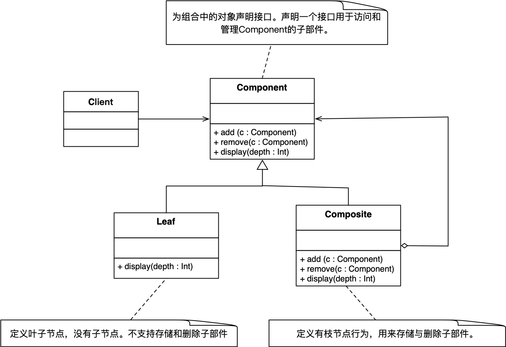

### 概念

能够帮助实现树状结构的模式。

主要特点

- 递归组合
- 树状结构
- 统一处理所有对象

#### 角色介绍

- Component: 组合接口
- Leaf: 叶子节点，无子节点
- Composite：枝节点，用来存储子部件

#### UML



### 代码实现

```kt
interface Organ {
    fun personCount():Int
}
class LeafDepartment1 : Organ {
    override fun personCount() = 4
}

class LeafDepartment2 : Organ {
    override fun personCount() = 5
}
class CompositeDepartment : Organ {
    val list = ArrayList<Organ>()

    fun add(organ: Organ) {
        list.add(organ)
    }

    override fun personCount(): Int {
        var sum = 0
        list.forEach {
            sum += it.personCount()
        }
        return sum
    }
}

fun main() {
    val compDepart = CompositeDepartment()
    compDepart.add(LeafDepartment1())
    compDepart.add(LeafDepartment2())

    println("personCount: ${compDepart.personCount()}")
}
```

### 优缺点

优点

- 简化客户端操作
- 易于扩展，增加新组建

缺点

- 可能违反开闭原则

### 应用场景

- 层次结构系统，如安卓的view像叶子节点，viewgroup像枝节点，一起构建视图。
- 对单个对象和组合对象进行相同操作

### 总结

使用组合模式时，需要确保接口适合叶子结点和组合对象，把可选方法放入具体的叶子结点。
