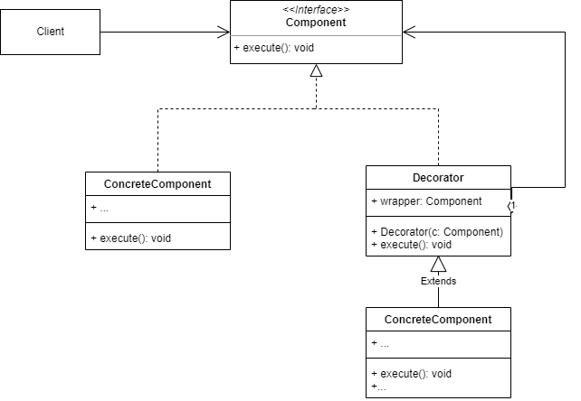

### 概念

装饰模式指的是在不必改变原类文件和使用继承的情况下，动态地扩展一个对象的功能。它是通过创建一个包装对象，也就是装饰来包裹真实的对象。可以运行时动态添加新的功能，而无需改变原来的代码。
特点：
- 灵活扩展新的功能
- 动态添加额外职责

#### 角色介绍

- Component: 抽象组件，定义抽象规范
- ConcreteComponent：具体子类，实现抽象构建声明的方法
- Decorator：抽象装饰器，也是抽象构建类的子类，维护一个指向抽象构建类的引用，通过引用调用装饰之前构建对象的方法，并通过子类扩展方法，最终达到装饰的目的。
- ConcreteDecorator：具体装饰器，继承抽象装饰器，可以调用抽象装饰器定义的方法也可以添加新的方法。

#### UML



### 代码实现
kt中实现装饰器有两种方式
一，类委托
通过by关键字将装饰类的所有方法委托给一个被装饰的类对象，只需复写装饰的方法即可。
```kt
interface Coffee {
    val name: String
    fun cost(): Float
}

class SimpleCoffee : Coffee {
    override val name: String = "咖啡"
    override fun cost(): Float = 6f
}

abstract class CoffeeDecorator(protected val coffee: Coffee) : Coffee by coffee
class MilkDecorator(coffee: Coffee) : CoffeeDecorator(coffee) {
    override val name: String = "牛奶${coffee.name}"
    override fun cost(): Float {
        return coffee.cost() + 2
    }
}

class SugarDecorator(coffee: Coffee) : CoffeeDecorator(coffee) {
    override val name: String = "多糖${coffee.name}"
    override fun cost(): Float {
        return coffee.cost() + 3
    }
}

fun main() {
    val coffee: Coffee = SimpleCoffee()
    val coffeeWithMilk: Coffee = MilkDecorator(coffee)
    val coffeeWithMilkAndSugar: Coffee = SugarDecorator(coffeeWithMilk)
    println("${coffee.name} -> ${coffee.cost()}")
    println("${coffeeWithMilk.name} -> ${coffeeWithMilk.cost()}")
    println("${coffeeWithMilkAndSugar.name} -> ${coffeeWithMilkAndSugar.cost()}")
}
```
二，使用扩展函数
该方式只能新增新的方法，不能复写原有方法。且复写的方法只在相应的模块有效其他地方无效。
### 优缺点

优点
- 提高灵活性和可扩展性
- 简便不同的组合
- 提高可维护性

缺点
- 代码复杂性增加
- 增加性能开销

### 应用场景

在不影响其他对象的情况下，为单个对象增加新功能，动态组合各种可选功能。
- GUI可视化组件
- 通信协议
- 日志系统
- 权限控制系统

### 总结

通过装饰器模式，我们可以复写行为、直接调用原有方法，还可以扩展行为。
相似模式对比：
| 模式 | 目的 | 模式主要角色 | 应用场景 |
|--|--|--|--|
| Builder生成器 | 分布构建复杂对象 | 指挥者，生成器 | 构建具有复杂逻辑的对象 |
| Composite组合 | 表示具有层次结构的对象 | 组合类和叶子节点 | 树形结构和递归结构 |
| Decorator装饰器 | 动态添加新功能 | 抽象组件和装饰器 | 功能组合和扩展 |

参考：
- [Kotlin 设计模式-装饰器](https://blog.csdn.net/soslinken/article/details/78559528)
- [装饰器模式（Decorator Pattern）总结](https://zhuanlan.zhihu.com/p/86165647)