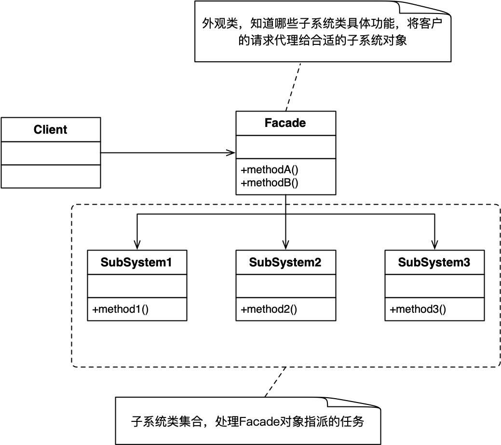

### 概念

又称门面模式，为复杂系统提供简单交互接口。

#### 角色介绍

- Facade：外观类，供客户端调用，将请求委派给响应的子系统。
- SubSystem：子系统，独立的子设备或子类

#### UML



### 代码实现

```kt
class Light(val name: String) {
    fun turnOn() {
        println("${name}灯打开")
    }

    fun turnOff() {
        println("${name}灯关闭")
    }
}

class TV {
    fun power(boolean: Boolean) {
        println("电视电源${boolean}")
    }
}

class AirConditioner {
    fun open() {
        println("空调打开")
    }

    fun sleep() {
        println("空调睡眠")
    }

    fun close() {
        println("空调关闭")
    }
}
class SmartSceneFacade {
    private val lights = arrayListOf<Light>(Light("客厅"), Light("卧室"))
    private val tv = TV()

    private val airConditioner = AirConditioner()


    fun goHome() {
        println("回家场景：")
        lights[0].turnOn()
        airConditioner.open()
    }

    fun goToWork() {
        println("去上班：")
        for (light in lights) {
            light.turnOff()
        }
        tv.power(false)
        airConditioner.close()
    }

    fun nightSleep() {
        println("要睡觉了：")
        for (light in lights) {
            light.turnOff()
        }
        tv.power(false)
        airConditioner.sleep()
    }
}

fun main() {
    val smartSceneFacade = SmartSceneFacade()
    smartSceneFacade.goToWork()
    smartSceneFacade.goHome()
    smartSceneFacade.nightSleep()
}
```

### 优缺点

优点
- 简化交互方式
- 解耦合
- 提高可维护性

缺点
- 不合符开闭原则
- 隐藏潜在问题
### 应用场景

子系统接口复杂，需要将子系统划分为多个层次，解偶客户端与子系统
- 复杂的lib
- 扩平台的程序
- 电商系统

### 总结

外观模式相当于在子类上又包了一层，是迪米特法则的典型应用。