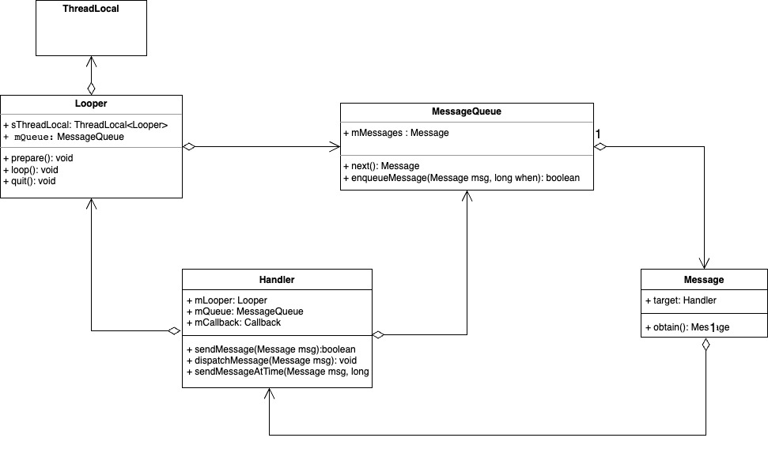

### 概念

目标是最小化内存的使用，节省内存

#### 特点

- 共享相似的实例

- 把实例的共享状态和不共享状态分开

#### UML


由Shape接口和实现Shape接口的实体类Circle，然后定义Shape工厂通过map管理Circle对象，如果找到则返回，否则会创建新的对象存放在map中。代码实现参考[【享元模式】](https://www.runoob.com/design-pattern/flyweight-pattern.html)。

### 代码实现

```kt
interface Shape {
    fun draw()
}
class Circle(var color: String? = null) : Shape {
    var x: Int = -1
    var y: Int = -1
    var radius: Int = 0
    override fun draw() {
        println("hash=${hashCode()}:draw(color=$color,x=$x,y=$y,r=$radius)")
    }
}
object ShapeFactory {
    private val circleMap = HashMap<String, Shape>()

    fun getCircle(color: String): Shape {
        var circle = circleMap[color]
        if (circle == null) {
            circle = Circle(color)
            circleMap[color] = circle
            println("cache circle $color-color")
            return circle
        }
        return circle
    }
}

fun main() {
    val colors = arrayListOf("Red", "Green", "Blue", "White", "Black")

    repeat(20) {
        val color = colors[(0..4).random()]
        val circle = ShapeFactory.getCircle(color) as Circle
        circle.apply {
            x = (0..100).random()
            y = (0..100).random()
            radius = 5
        }
        circle.draw()
    }
}
```

### 优缺点

优点有哪些

- 减少内存使用

- 提高性能

- 可扩展性

缺点有哪些

- 复杂度：内外部状态，享元工厂

- 多线程环境困难

- 适用性有限

### 应用场景

需要大量共享数据

- 文字编辑器和处理器

- 图形应用

- 游戏开发

### 总结

安卓的Handler中的Message推荐使用Message.obtain()方法复用Message对象， Message就使用了享元模式。



Message持有一个静态的单链表，Message实现复用通过obtain方法实现，检查单链表中是否有可复用的Message。

```java
    private static final Object sPoolSync = new Object();
    private static Message sPool;
    private static int sPoolSize = 0;

    private static final int MAX_POOL_SIZE = 50;

    private static boolean gCheckRecycle = true;

    /**
     * Return a new Message instance from the global pool. Allows us to
     * avoid allocating new objects in many cases.
     */
    public static Message obtain() {
        synchronized (sPoolSync) {
            if (sPool != null) {
                Message m = sPool;
                sPool = m.next;
                m.next = null;
                m.flags = 0; // clear in-use flag
                sPoolSize--;
                return m;
            }
        }
        return new Message();
    }
        /**
     * Same as {@link #obtain()}, but sets the value for the <em>target</em> member on the Message returned.
     * @param h  Handler to assign to the returned Message object's <em>target</em> member.
     * @return A Message object from the global pool.
     */
    public static Message obtain(Handler h) {
        Message m = obtain();
        m.target = h;

        return m;
    }
        /**
     * Recycles a Message that may be in-use.
     * Used internally by the MessageQueue and Looper when disposing of queued Messages.
     */
    void recycleUnchecked() {
        // Mark the message as in use while it remains in the recycled object pool.
        // Clear out all other details.
        flags = FLAG_IN_USE;
        what = 0;
        arg1 = 0;
        arg2 = 0;
        obj = null;
        replyTo = null;
        sendingUid = -1;
        when = 0;
        target = null;
        callback = null;
        data = null;

        synchronized (sPoolSync) {
            if (sPoolSize < MAX_POOL_SIZE) {
                next = sPool;
                sPool = this;
                sPoolSize++;
            }
        }
    }
```

这里有个疑问，sPool是在哪里初始化的？复用对象是在哪里存放到单链表中的？

```java
    /**
     * Run the message queue in this thread. Be sure to call
     * {@link #quit()} to end the loop.
     */
    public static void loop() {
        final Looper me = myLooper();
        if (me == null) {
            throw new RuntimeException("No Looper; Looper.prepare() wasn't called on this thread.");
        }
        final MessageQueue queue = me.mQueue;

        // Make sure the identity of this thread is that of the local process,
        // and keep track of what that identity token actually is.
        Binder.clearCallingIdentity();
        final long ident = Binder.clearCallingIdentity();

        // Allow overriding a threshold with a system prop. e.g.
        // adb shell 'setprop log.looper.1000.main.slow 1 && stop && start'
        final int thresholdOverride =
                SystemProperties.getInt("log.looper."
                        + Process.myUid() + "."
                        + Thread.currentThread().getName()
                        + ".slow", 0);

        boolean slowDeliveryDetected = false;

        for (;;) {
            Message msg = queue.next(); // might block
            if (msg == null) {
                // No message indicates that the message queue is quitting.
                return;
            }

            // ...

            final long dispatchStart = needStartTime ? SystemClock.uptimeMillis() : 0;
            final long dispatchEnd;
            try {
                msg.target.dispatchMessage(msg);
                dispatchEnd = needEndTime ? SystemClock.uptimeMillis() : 0;
            } finally {
                if (traceTag != 0) {
                    Trace.traceEnd(traceTag);
                }
            }
            // ...

            msg.recycleUnchecked();
        }
    }
```

参考：

- [Android Framework：探索Handler的设计思想](https://zhuanlan.zhihu.com/p/434338043)

- [Android---Handler 源码解析](https://blog.csdn.net/qq_44950283/article/details/129098563)
