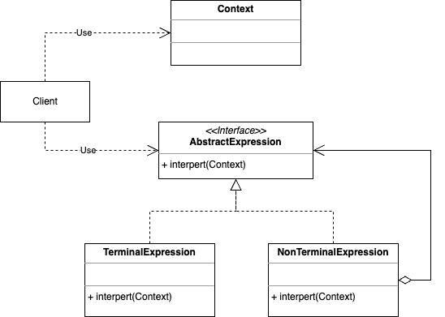

### 概念

一个专门用来处理语言或者解析表达式的设计模式，比如sql、正则，将解析和解释分离，特别适合处理特定领域的语言。

#### 角色介绍

- Abstract Expression：抽象表达式
- Terminal Expression：终结符表达式
- Non-Terminal Expression：非终结符表达式
- Context：上下文

#### UML



### 代码实现

```kt
/**
 * 抽象表达式
 */
interface Expression {
    fun interpret(str: String): Boolean
}

class TerminalExpression(data: Array<String>) : Expression {
    private val set = HashSet<String>()

    init {
        for (s in data) {
            set.add(s)
        }
    }

    override fun interpret(str: String): Boolean {
        return set.contains(str)
    }
}
class AndExpression(val left: Expression, val right: Expression) : Expression {

    override fun interpret(str: String): Boolean {
        val arry = str.split(SPLIT)
        return left.interpret(arry[0]) && right.interpret(arry[1])
    }

    companion object {
        const val SPLIT = "的"
    }
}
class Context {
    private val citys = arrayOf("北京", "太原")
    private val persons = arrayOf("老人", "孕妇")

    private val expression: Expression

    init {
        expression = AndExpression(TerminalExpression(citys), TerminalExpression(persons))
    }

    fun freeRide(info: String) {
        //提示语，可自行设置
        val s1 = "哔！" + info.split(AndExpression.SPLIT)[1] + "卡，欢迎乘车，您本次乘车免费！"
        val s2 = "哔！欢迎乘车，您本次乘车扣费2元！"
        println(if (expression.interpret(info)) s1 else s2)
    }
}

fun main() {
    val bus = Context()
    bus.freeRide("北京的老人")
    bus.freeRide("太原的孕妇")
    bus.freeRide("太原的儿童")
    bus.freeRide("上海的老人")
}
```

### 优缺点

优点：

- 易于扩展或者修改
- 灵活
- 关注点分离
- 代码复用

缺点：

- 性能问题
- 调试困难
- 复杂性增加
- 实用性有限

### 应用场景

- 领域特定语言
- 复杂输入解释
- 可扩展的语言结构

比如编译器、解释器，配置文件解析，查询语言解析，日志处理（脚本语言或编程语言处理日志时，有很多服务会产生大量日志，需要对日志进行解析生成报表，各服务的日志格式不同数据要素相同）等。

### 总结

适用某个特定类型问题发生频率足够高的场景，对于复杂文法解释器模式不是一个很好的选择。
