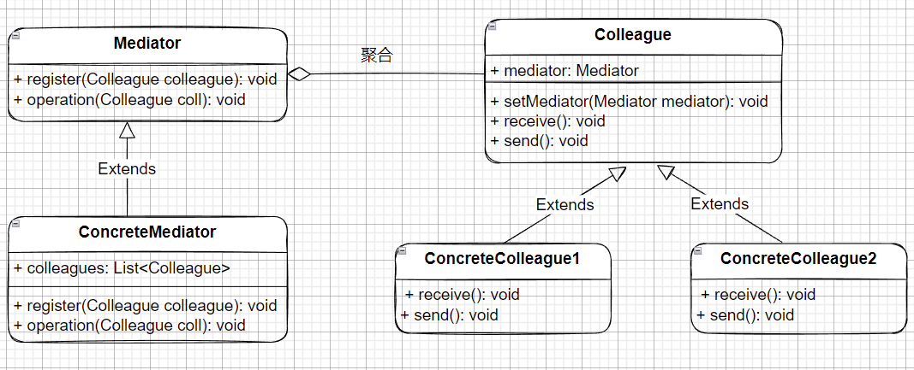

### 概念

创建一个中介来降低对象之间的耦合度，关系”多对多“变为“一对多”

#### 角色介绍

- Mediator：抽象中介者，接口或者抽象类。
- ConcreteMediator：中介者具体实现，实现中介者接口，定义一个List管理Colleague对象。
- Colleague：抽象同事，定义同事类的接口或者抽象类，保存中介者对象，实现同事类通用的方法。
- ConcreteColleague：具体同事类，实现抽象同事类。通过中介者间接完成具体同事类之间的通信。

#### UML

实际应用中中介者、同事类，可以不用抽象。


### 代码实现

```kt
interface UserAbs {
    fun enter(chatRoom: ChatRoom)
    fun send(msg: String)
    fun receive()
}

data class User(val name: String) : UserAbs {
    private var room: ChatRoom? = null

    override fun enter(chatRoom: ChatRoom) {
        room = chatRoom
        room?.enter(this)
    }

    override fun send(msg: String) {
        room?.operation(this, msg)
    }

    override fun receive() {
        room?.getMessage()?.forEach {
            println(it)
        }
    }
}
class ChatRoom(val id: Int) {
    private val messages = ArrayList<String>()

    fun enter(user: User) {
        println("${user.name}进入聊天室$id")
    }

    fun operation(user: User, msg: String) {
        val log = "${user.name}说了$msg"
        println(log)
        messages.add(log)
    }

    fun getMessage(): MutableList<String> {
        return messages
    }
}

fun main() {
    val room = ChatRoom(1)
    val user1 = User("张三")
    val user2 = User("李四")
    val user3 = User("王八")
    user1.enter(room)
    user2.enter(room)
    user3.enter(room)
    user1.send("你好")
}
```

### 优缺点

优点
- 简化对象间的关系
- 提高灵活性
- 促进低耦合

缺点
- 中介者过于庞大

### 应用场景

适用于复杂通信对象组，重用对象。

1. 聊天应用，聊天室
2. 空中交通控制系统
3. GUI框架，MVC架构 Controller是中介者，根据View的请求Model
4. 工作流引擎，协调用户界面、事件之间的关系

### 总结
中介者模式核心在于引入中介者类，承担中转和协调作用。MediatorLiveData就是使用了中介者模式，可用来管理、合并多个数据源。它的源码可以参考：
参考：
- [基于MediatorLiveData实现红点的统一管理 ](https://juejin.cn/post/6945419430176227359)
- [MediatorLiveData使用](https://developer.android.google.cn/reference/androidx/lifecycle/MediatorLiveData)
- [中介者模式及其应用场景](https://blog.csdn.net/hello_1566/article/details/124342204)
