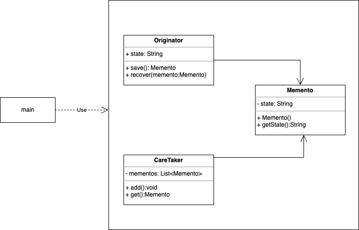

### 概念

备忘录模式是一种行为型设计模式，用于捕获和存储对象的内部状态，并在需要时将对象恢复到之前的状态。
备忘录模式允许在不暴露对象内部实现细节的情况下，对对象进行状态的保存和恢复。

#### 角色介绍

- Originator：原发器，负责创建备忘录对象，并将其当前状态保存到备忘录中，也可以从备忘录中恢复自身状态。
- Memento：备忘录，用于存储发起人的状态，通常具备对发起人状态的访问权限。
- Caretaker：管理者，负责管理备忘录对象，可以保存多个备忘录对象，并在需要时将其提供给发起人进行状态的恢复。

#### UML



### 代码实现

```kt
/**
 * 备忘录
 */
data class Memento(
    val state: String? = null
)

/**
 * 原发器
 */
class Originator {
    var state: String? = null

    fun save(): Memento {
        return Memento(state)
    }

    fun recover(memento: Memento) {
        state = memento.state
    }

}

/**
 * 看管人
 */
class Caretaker {
    private val mementos = ArrayList<Memento>()

    fun addMemento(memento: Memento) {
        mementos.add(memento)
    }

    fun getMemento(i: Int): Memento {
        return mementos[i]
    }
}

fun main() {
    val originator = Originator()
    val caretaker = Caretaker()
    originator.state = "State#1"
    originator.state = "State#2"
    caretaker.addMemento(originator.save())
    originator.state = "State#3"
    caretaker.addMemento(originator.save())
    originator.state = "State#4"

    println("Current State:${originator.state}")
    originator.recover(caretaker.getMemento(0))
    println("0 State:${originator.state}")
    originator.recover(caretaker.getMemento(1))
    println("1 State:${originator.state}")
}
```

### 优缺点

**优点**
- 封装性
- 简易恢复和撤销
- 简化发起人
**缺点**
- 增加内存使用
- 性能开销
- 复杂性
### 应用场景

适用于需要维护对象状态的历史记录，而不想暴露复杂的内部状态。 
- 文本编辑器
- 绘图应用程序
- 数据库系统
- 游戏开发
- 版本控制系统

### 总结

备忘录适用于需要保存/恢复数据的相关状态场景，并提供一个可回滚的操作。
为了符合迪米特原则，还需增加一个管理备忘录的类；为了节省内容可使用配合原型模式使用。

参考：

- https://www.cnblogs.com/jiangzhaowei/p/7287359.html
- https://www.runoob.com/design-pattern/memento-pattern.html
- https://www.cnblogs.com/cativen/p/16641173.html
