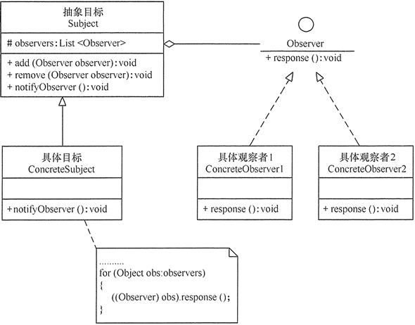

### 概念

定义一对多的依赖关系，让多个观察者同时监听一个主题对象。

#### 角色介绍

- Subject：主题，也称被观察者，它是具有状态的对象维护着一个观察者列表。提供添加、删除和通知观察者的方法。
- ConcreteSubject：具体主题，主题的具体实现类，维护观察者列表，状态改变时通知观察者。
- Observer：观察者，接受主题通知的对象，需实现一个更新方法。
- ConcreteObserver：具体观察者，观察者的具体实现类，定义收到主题通知后需要执行的具体操作。

#### UML



### 代码实现

```kt
import kotlin.properties.Delegates

class TextView {
    var listener: TextChangedListener? = null

    // 可观察者属性，接收两个参数 初始值；修改处理器handler,handler会在每次赋值时调用，接收三个参数：当前属性声明，旧值，新值
    // Delegates.vetoable 可对属性赋值进行拦截，返回false即为拦截
    var text: String by Delegates.observable("init") { _, oldValue, newValue ->
        listener?.onChanged(oldValue, newValue)
    }
    var value: Int by Delegates.vetoable(0) { _, oldValue, newValue ->
        val ret = newValue > 0
        listener?.onChanged(oldValue, newValue, ret)
        ret
    }
}

fun main() {

    val textView = TextView().apply {
        listener = TextChanged()
    }
    textView.text = "first"
    textView.text = "second"
    textView.run {
        value = 1
        println("vetoable: ${value}")
        value = 5
        println("vetoable: ${value}")
    }
}
```
控制台输出：
>onChanged: init -->  first
onChanged: first -->  second
onChanged: true 0 -->  1
vetoable: 1
onChanged: true 1 -->  5
vetoable: 5

### 优缺点

优点
- 广播通信
- 低耦合
- 支持事件处理

缺点
- 开销较大
- 实现较复杂

### 应用场景

多对象间广播通信，一个对象的改变需要通知其他对象改变。
- 社交媒体平台
- 股票市场
- GUI工具
- 实时消息系统

### 总结

java提供了java.util.Observable 类和java.util.Observer接口来帮助实现观察者模式，kt中我们可以通过委托属性实现，更简洁优雅。
安卓中LiveData、EventBus等都是基于观察者设计实现的。

关于委托属性参考：
- [kotlin入门潜修之类和对象篇—委托及其原理](https://www.jianshu.com/p/aedc1174d798)
- [Kotlin委托的原理与使用，以及在Android开发中常用的几个场景](https://juejin.cn/post/7213267574770090039)
- [Kotlin开发 委托by - 观心静](https://www.cnblogs.com/guanxinjing/p/15612060.html)
