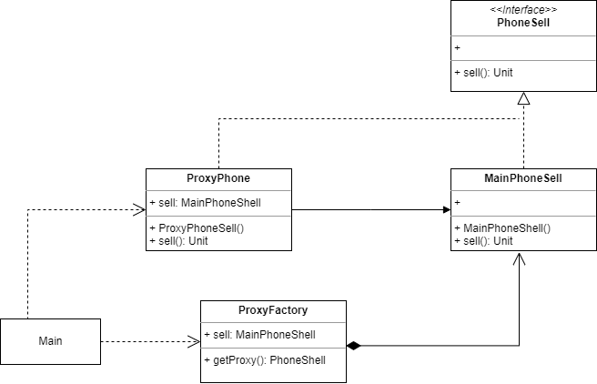

### 概念

又称委托模式，充当中介代理的类。
特点：让一个对象控制另一个对象的访问，让代理充当其他事物的接口。

#### 角色介绍

- 抽象目标类
- 具体目标类
- 代理类

#### UML


### 代码实现

按实现分为静态和动态代理

```kt
interface PhoneSell {
    fun sell()
}

class MainPhoneSell : PhoneSell {
    override fun sell() {
        println("手机销售")
    }
}
```

#### 静态代理

代理类拿到被代理实例后，调用被代理类的方法，同时可以对代理方法进行增强。

```kt
class ProxyPhoneSell : PhoneSell {
    private val mainPhoneSell = MainPhoneSell()
    override fun sell() {
        println("赚取200元服务费")
        mainPhoneSell.sell()
    }
}
```

#### 动态代理

动态代理是java提供的一个动态代理类Proxy，通过它的方法newProxyInstance来创建代理实例。它有三个参数

- loader(ClassLoader): 这个参数是实际被代理类的类加载器实例。
- interfaces(Class[]): 代理类和被代理类共同实现的接口的Class数组。
- h(InvocationHandler): 代理拦截器接口，一般需要使用子类去实现该接口或匿名类去实现。

```kt
class ProxyFactory {
    private val phoneSell = MainPhoneSell()
    fun getProxy() = Proxy.newProxyInstance(
        phoneSell.javaClass.classLoader,
        phoneSell.javaClass.interfaces
    ) { proxy, method, args ->
        println("收取200元服务费")
        method.invoke(phoneSell, *args.orEmpty())
    } as PhoneSell
}
```

分别调用

```kt
fun main() {
    ProxyPhoneSell().sell()
    ProxyFactory().getProxy().sell()
}
```

### 优缺点

优点：
- 关注点分离
- 访问控制
- 延迟实例化
- 远程访问
- 缓存
- 扩展额外的行为

缺点：
- 增加复杂性
- 间接性
- 性能开销

### 应用场景
按职责来划分，通常有以下使用场景： 
1. 远程代理：根据用户的访问权限控制对实际对象的访问
2. 虚拟代理：需要使用时才创建它，类似于by lazy
3. Copy-on-Write代理
4. 保护（Protect or Access）代理
5. Cache代理：缓存对象操作结果
6. 防火墙（Firewall）代理
7. 同步化（Synchronization）代理
8. 智能引用（Smart Reference）代理
还可用于日志记录、监控和审计。

### 总结
静态代理比较简单，但代码的维护和复用上还是动态代理好一点。
注意事项： 
1. 和适配器模式的区别：适配器模式主要改变所考虑对象的接口，而代理模式不能改变所代理类的接口。 
2. 和装饰器模式的区别：装饰器模式为了增强功能，而代理模式是为了加以控制。
这里有一个面试题：动态代理为什么只能基于接口？
因为它使用的是Java中的反射机制来创建代理对象。在Java中，类可以通过实现接口来达到多态的效果。因此，JDK动态代理要求目标对象必须实现至少一个接口，
这样才能通过反射获取到目标对象实现的接口列表，进而动态地创建代理类。具体来说，JDK动态代理是通过实现目标接口的方式来创建代理类的，代理类会实现目标接口中定义的所有方法，
并在代理类中通过反射调用目标对象的方法，从而完成代理的功能。因此，如果目标对象没有实现任何接口，那么JDK动态代理就无法生成代理类。
参考：
- [当Kotlin邂逅设计模式之代理模式(二) ](https://xiaozhuanlan.com/topic/3425819760)
- [代理模式](https://www.runoob.com/design-pattern/proxy-pattern.html)
