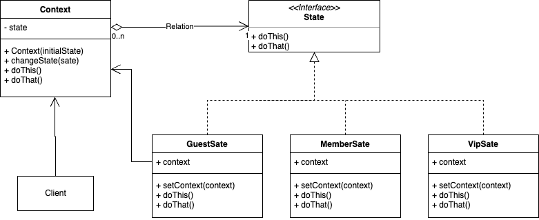

### 概念

允许一个对象内部状态改变时改变它的行为。

#### 角色介绍

- State状态接口或抽象
- ConcreteState具体状态
- Context上下文

#### UML



### 代码实现

```kt
abstract class UserState(val user: User) {
    abstract fun play4k()

    abstract fun play720P()

    abstract fun play1080P()
}

class GuestState(user: User) : UserState(user) {
    override fun play4k() {
        throw RuntimeException("游客禁止播放4k视频")
    }

    override fun play720P() {
        println("正在播放720P视频")
    }

    override fun play1080P() {
        throw RuntimeException("游客禁止播放1080视频")
    }
}

class MemberState(user: User) :UserState(user) {
    override fun play4k() {
        throw RuntimeException("会员禁止播放4k视频")
    }

    override fun play720P() {
        println("正在播放720P视频")
    }

    override fun play1080P() {
        println("正在播放1080视频")
    }
}

class VipState(user: User) :UserState(user) {
    override fun play4k() {
        println("Vip播放4k视频")
    }

    override fun play720P() {
        println("Vip播放720P视频")
    }

    override fun play1080P() {
        println("Vip播放1080P视频")
    }
}


class User(val name: String){
    private var userState:UserState
    init {
        userState = GuestState(this)
    }

    fun register(){
        userState = MemberState(this)
    }

    fun openVIP(){
        userState = VipState(this)
    }

    fun play4k() {
        userState.play4k()
    }

    fun play720P() {
        userState.play720P()
    }

    fun play1080P() {
        userState.play1080P()
    }
}

fun main() {
    val user = User("张三")
    user.play720P()
//    user.register()
    user.play1080P()
//    user.openVIP()
    user.play4k()
}
```

### 优缺点

优点
- 封装信
- 简化代码，易于扩展

缺点
- 类数量增多
- 逻辑变复杂，对“开闭原则”支持不太好。增加新的状态类需要修改负责状态切换上下文，否则无法切到新增状态；修改某个状态类的行为也需修改对应的状态类。

### 应用场景

替代代码中条件、分支语句，行为随状态而改变的场景。
1. 游戏角色状态切换
2. 网络连接状态管理
3. 订单状态管理

### 总结

和策略模式区别
1. 状态模式强调不同情况下对目标方法的控制，有的方法甚至不会执行（空实现）。策略模式中的行为都是等价的可以平替，只是算法执行过程不同，输入输出类型一致。
2. 状态模式不会对Client暴露状态，上下文对象内部切换，策略模式是由Client自主决定使用那种策略。
