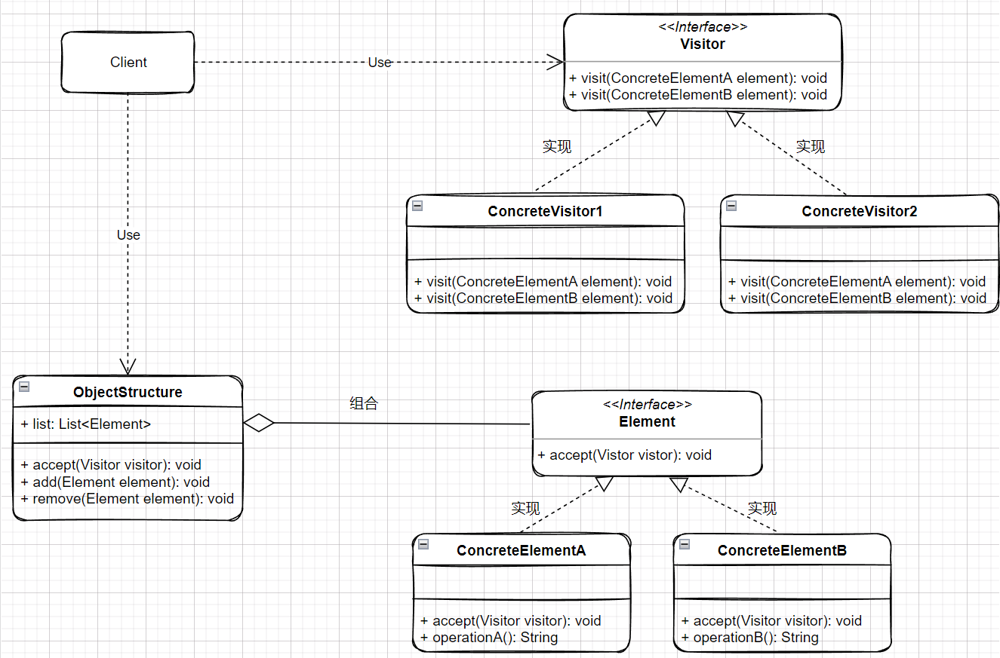

### 概念

将数据结构和操作分离，使操作集合可以独立于数据结构变化。

#### 角色介绍

- Element
- ConcreteElement
- Visitor
- ConcreteVisitor

#### UML



### 代码实现

```kt
interface Visitor {
    fun visit(wine: Wine): Float
    fun visit(pig: Pig): Float
    fun visit(television: Television): Float
}
interface Goods {
    fun accept(visitor: Visitor): Float
    fun account(): Float
}

/**
 * 酒类
 */
data class Wine(
    val count: Int,
    val price: Float
) : Goods {
    override fun accept(visitor: Visitor): Float {
        return visitor.visit(this)
    }

    override fun account(): Float {
        println("酒按瓶计价，购买数量为：${count}瓶，单价为$price")
        return count * price
    }
}

/**
 * 猪肉
 */
data class Pig(
    val count: Int,
    val price: Float
) : Goods {
    override fun accept(visitor: Visitor): Float {
        return visitor.visit(this)
    }

    override fun account(): Float {
        println("猪肉按斤计价，购买数量为：${count}斤，单价为$price")
        return count * price
    }
}

/**
 * 电视
 */
data class Television(
    val count: Int,
    val price: Float
) : Goods {
    override fun accept(visitor: Visitor): Float {
        return visitor.visit(this)
    }

    override fun account(): Float {
        println("电视按件台价，购买数量为：${count}台，单价为$price")
        return count * price
    }
}
class VisitorImpl : Visitor {
    override fun visit(wine: Wine): Float {
        return wine.account()
    }

    override fun visit(pig: Pig): Float {
        return pig.account()
    }

    override fun visit(television: Television): Float {
        return television.account()
    }
}
class ShoppingList {
    val list = ArrayList<Any>()
    fun add(any: Any) {
        list.add(any)
    }

    fun remove(any: Any) {
        list.remove(any)
    }
}
class AccountMachine {
    private var awt: Float = 0f

    fun getAwt(list: MutableList<Any>): Float {
        val visitor: Visitor = VisitorImpl()
        for (item in list) {
            awt += (item as Goods).accept(visitor)
        }
        return awt
    }
}

fun main() {
    val wine = Wine(10, 5f)
    val pig = Pig(2, 18f)
    val tv = Television(1, 2300f)
    val shoppingList = ShoppingList()
    shoppingList.add(wine)
    shoppingList.add(pig)
    shoppingList.add(tv)
    val accountMachine = AccountMachine()
    val awt = accountMachine.getAwt(shoppingList.list)
    println("总价：$awt")
}
```

### 优缺点

优点
- 分离操作和数据结构
- 增加新操作更容易
- 集中化操作
缺点
- 增加新数据结构困难
- 破坏封装
### 应用场景

适用于数据结构稳定，操作易变，对象的操作之间无关联的场景。
- 编译器
- 文档转化，比如markdown转html

### 总结

安卓开发中RecyclerView，Adapter是访问者对象，而RecyclerView.ViewHolder是一个被访问者对象。
RecyclerView.Adapter 中，我们需要实现 onCreateViewHolder()、onBindViewHolder() 和 getItemCount() 等方法。
这些方法被用于创建 ViewHolder 对象、绑定数据和获取列表项的数量等操作
在 RecyclerView.ViewHolder 中，我们需要定义列表项的视图控件，并在构造函数中将其初始化。当 Adapter 对象需要绑定数据时，ViewHolder 对象会被创建并传递给 Adapter 对象的 onBindViewHolder() 方法中，从而实现对列表项的访问和操作。
还有就是我们在写一些自定义Lint、Idea或者grade插件时也会简单访问者模式。
参考：

- [访问者模式及其应用场景](https://blog.csdn.net/hello_1566/article/details/124456454)
- [重新认识访问者模式：从实践到本质 ](https://juejin.cn/post/7072928300682706975)
- [设计模式-访问者模式及应用 ](https://juejin.cn/post/7026956210045714440)
- [设计模式：访问者（Visitor）模式](https://www.cnblogs.com/zyrblog/p/9244754.html)